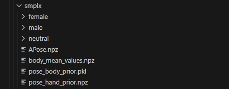
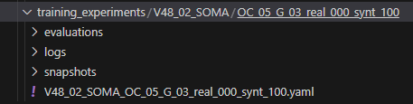
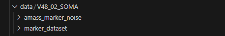
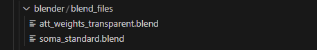
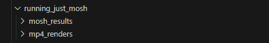
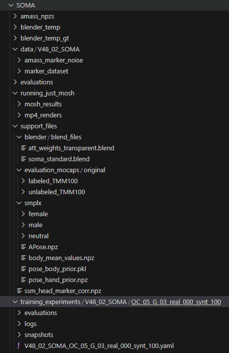

# SOMA: Solving Optical Marker-Based MoCap Automatically, ICCV'21

This repository contains an altered implementation of:

SOMA: Solving Optical Marker-Based MoCap Automatically\
Nima Ghorbani and Michael J. Black\
[Paper](https://download.is.tue.mpg.de/soma/SOMA_ICCV21.pdf) | [Supp.Mat.](https://download.is.tue.mpg.de/soma/SOMA_Suppmat.pdf) | [Video](https://www.youtube.com/watch?v=BEFCqIefLA8&t=1s&ab_channel=MichaelBlack) | [Project website](https://soma.is.tue.mpg.de/) | [Poster](https://download.is.tue.mpg.de/soma/SOMA_Poster.pdf)

 turned into labeled markers (colored dots)")

SOMA **automatically transforms raw marker-based mocap point clouds** (black dots in the back) into **solved SMPL-X bodies** and **labeled markers** (colored dots).

## Dependency Installation

SOMA is originally developed in Python 3.7, PyTorch 1.8.2 LTS, for Ubuntu 20.04.2 LTS, though any later version of PyTorch and Ubuntu will do.
Required is a CPU with x86 architecture.
Below we prepare the python environment using [Anaconda](https://www.anaconda.com/products/individual), 
however, we opt for a simple pip package manager for installing dependencies.

````
sudo apt install libatlas-base-dev
sudo apt install libpython3.7
sudo apt install libtbb2
sudo apt install libfftw3
sudo apt install ffmpeg

conda create -n soma python=3.7 
conda activate soma
conda install -c conda-forge ezc3d

pip3 install torch==1.8.2+cu102 torchvision==0.9.2+cu102 torchaudio==0.8.2 -f https://download.pytorch.org/whl/lts/1.8/torch_lts.html

````
ezc3d installation is currently not supported by pip. Remember to activate the conda environment in new terminals by running ```conda activate soma```.

Assuming that you have already cloned this repository to your local drive 
go to the root directory of SOMA code and run
````
pip install -r requirements.txt
python setup.py develop
````
Use [soma_env.txt](soma_env.txt) as reference for package versions if needed.

Clone the psbody.mesh library repository via [https://github.com/Divyesh-Johri/mesh](https://github.com/Divyesh-Johri/mesh).
Then, go to its root directory and run the following from the SOMA anaconda environment:  ````python setup.py install ````.

Copy the precompiled 
[smpl-fast-derivatives](https://download.is.tue.mpg.de/download.php?domain=soma&sfile=smpl-fast-derivatives.tar.bz2) 
into the installed Mesh library in your python site-packages folder, i.e. ````anaconda3/envs/soma/lib/python3.7/site-packages/psbody_mesh-0.4-py3.7-linux-x86_64.egg/psbody ````.

To use the rendering capabilities first install an instance of Blender-2.83 LTS on your machine.
Afterward uncompress the precompiled 
[bpy-2.83](https://download.is.tue.mpg.de/download.php?domain=soma&sfile=blender/bpy-2.83-20200908.tar.bz2) package and place its contents (``` 2.83 ``` folder and ``` bpy.so ``` file) into your python site-packages folder, i.e. ````anaconda3/envs/soma/lib/python3.7/site-packages````.

Go to ```` anaconda3/envs/soma/lib/python3.7/site-packages/2.83/scripts/addons/cycles/source/kernel/kernels/cuda/kernel_config.h ````. At line 20, replace ``` #if __CUDA_ARCH__ == 300 || __CUDA_ARCH__ == 350 ``` with ``` #if __CUDA_ARCH__ >= 300 || __CUDA_ARCH__ == 350 ```. Or, perform the same alteration to a different if-statement to target a different version of CUDA, indicated by the comments in the file.

Go to ```` anaconda3/envs/soma/lib/python3.7/site-packages/body_visualizer/tools/render_tools.py ````. At line 26, replace logger.sucess() with logger.success().

Last but not least, the current SOMA code relies on [MoSh++](https://github.com/Divyesh-Johri/moshpp) mocap solver. 
Please install MoSh++ following the guidelines in its repository from SOMA's anaconda environment.


## Creating the work directory

This part of the installation can be done quickly by downloading [this zipped file](https://pennstateoffice365-my.sharepoint.com/:u:/g/personal/dkj5225_psu_edu/EcpqtdHSr9FBlfRdrgvQ_2EB1kdU5q9PeiUZrjQpj9JDyw) and unzipping its contents (```SOMA/``` folder), which contains the entire work directory. Then, follow the subsection **YAML Files** below to fit the work directory to the local environment. Note that the zip contains labeled and unlabeled TMM100 marker data, access to the original marker data can be obtained from [LPAC's webpage on PSU Taiji Multimodal](http://vision.cse.psu.edu/research/dynamicsFromKinematics/index.shtml).

If the zipped file expires, follow all the steps below to rebuild the work directory.

Create a new, separate directory. This will be known as ```` work ````. Then, create subdirectories called ```data```, ```evaluations```, ```support_files```, and ```training_experiments```. 

Follow the instructions below as well as the picture at the bottom to complete the directories and load the data.

### TMM100 dataset
Download TMM100's marker dataset and run the Matlab file [save_markers.m](create_datasets/save_markers.m) on the data to obtain the labeled (ground-truth) and unlabeled data.
Place the resulting folders (```labeled_TMM100``` and ```unlabeled_TMM100```) under ```` work/support_files/evaluation_mocaps/original ````.

### Prepare Body Model and Co.


Obtain a SMPL-X locked head body model for SOMA (SMPL-X with removed head bun, NPZ+PKL) from [this link](https://smpl-x.is.tue.mpg.de/download.php).
Also, download the [extra smplx data](https://download.is.tue.mpg.de/download.php?domain=soma&sfile=smplx/extra_smplx_data.tar.bz2)
and place it in ``` work/support_files/smplx ``` as you see in the above image.

Download the
[SSM head marker covariances](https://download.is.tue.mpg.de/soma/ssm_head_marker_corr.npz) and place it inside ```` work/support_files/ ````.

### SOMA Model


- Obtain the 
[pretrained SOMA model for the SOMA dataset](https://download.is.tue.mpg.de/download.php?domain=soma&sfile=training_experiments/V48_02_SOMA.tar.bz2) and place it under ```` work/training_experiments ```` (also shown in the image above).



- Obtain the [model parameters](https://download.is.tue.mpg.de/download.php?domain=soma&sfile=smplx/data/V48_01_SOMA.tar.bz2) and place it under ```` work/data ```` folder (also shown in the image above).

### YAML Files
- Go to ```` work/data/V48_02_SOMA/marker_dataset/settings.yaml ```` and ```` work/training_experiments/V48_02_SOMA/OC_05_G_03_real_000_synt_100 ```` and change any paths to fit the local environment.
    - Examples of both of these files with edits can be found in [example_yamls](example_yamls/).
- NOTE: Check out the YAML files in `````` soma/support_data/conf/ `````` ([this directory](support_data/conf/)) to learn more about the configurable settings for SOMA. You can change every value of run configurations inside the python files, so you do not need to change these YAML files directly, unless you want to change the default values for future cases. 
    - Addresses like ```` dirs.support_base_dir ```` point to a configuration key in the run YAML file; i.e. [soma_run_conf.yaml](support_data/conf/soma_run_conf.yaml).

### Rendering


- Download the [Blender blend files](https://download.is.tue.mpg.de/download.php?domain=soma&sfile=blender/blend_files.tar.bz2)
and place them in the new directory ```` work/support_files/blender/blend_files ```` (also shown in the image above).
- Create a new directory ```work/blender_temp``` and ```work/blender_temp_gt```.



- Create a new directory ```work/running_just_mosh/mp4_renders``` and ```work/running_just_mosh/mosh_results``` (shown in the image above).
- Create a new directory ``` work/amass_npzs ``` if converting to npz format.

Downloading stuff and placing it in the right location will hopefully pay off; so just hang on :)

From here on, we will assume your uncompressed files and directories look something like this:




## Run SOMA on Unlabeled Data and Evaluate Accuracy

After installing dependencies and creating the work directory, go to [src/soma_on_TMM100](src/soma_on_TMM100/) in the cloned SOMA repository.

To run SOMA on TMM100, change the work base directory in [run_soma.py](src/soma_on_TMM100/run_soma.py) and run the code.

  - The results will appear in `work/training_experiments/V48_02_SOMA/OC_05_G_03_real_000_synt_100/evaluations/soma_labeled_tracklet`.

To evaluate each sequence using the ground-truth data and aggregate the results, change the work base directory in [eval_soma.py](src/soma_on_TMM100/eval_soma.py) and run the code.
    
  - The results for each sequence will appear in `work/training_experiments/V48_02_SOMA/OC_05_G_03_real_000_synt_100/evaluations/soma_eval_tracklet`. The aggregated results file will appear in `work/evaluations`.


## MoSh-ing Labeled Data (Solving SMPL-X Bodies)

Go to [src/soma_on_TMM100](src/soma_on_TMM100/) in the cloned SOMA repo.

To solve bodies using MoSh++ on autolabeled data (data labeled by SOMA) change the work directory in [pred_mosh.py](src/soma_on_TMM100/pred_mosh.py) and run the code. Add a subject name (Subject1) to `fname_filter` to filter by subject and/or a marker sequence filename (MOCAP_MRK_1.mat) to filter by sequence. To then render the solved bodies in Blender, change the work directory in [pred_render.py](src/soma_on_TMM100/pred_render.py) and run the code. Filtering can be done the same way.
    
  - The results from MoSh++ will be in `work/training_experiments/V48_02_SOMA/OC_05_G_03_real_000_synt_100/evaluations/mosh_results_tracklet`. The meshes and images from rendering will be in `work/blender_temp` and the sequence video will be in `work/training_experiments/V48_02_SOMA/OC_05_G_03_real_000_synt_100/evaluations/blender_renders_tracklet`.

To solve bodies using MoSh++ on ground-truth data change the work directory in [gt_mosh.py](src/soma_on_TMM100/gt_mosh.py) and run the code. Adjust the `glob` function or assign `mocap_fnames` to a list of paths of ground-truth sequence files to filter by sequence. An example is provided in the code. To then render the solved bodies in Blender, change the work directory in [gt_render.py](src/soma_on_TMM100/gt_render.py) and run the code. Filtering can be done the same way.

  - The results from MoSh++ will be in `work/running_just_mosh/mosh_results`. The results of meshes and images from rendering will be in `work/blender_temp_gt` and the sequence videos will be in `work/running_just_mosh/mp4_renders`. 


## Saving the MoSh-ed Data as an AMASS npz

Go to [src/soma_on_TMM100](src/soma_on_TMM100/) in the cloned SOMA repo.

To save MoSh++ data as AMASS body parameters, go to [pkl_to_npz.py](src/soma_on_TMM100/pkl_to_npz.py), then change the work directory and the mosh results directory (to where the MoSh data is located). The variable `ds` helps indicate whether the MoSh data was solved on auto-labeled or ground-truth marker data.

  - The results will be in `work/amass_npzs`.
