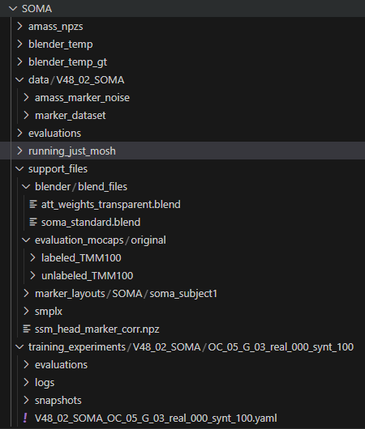

# Creating the Work Directory

Create a new, separate directory. This will be known as ```` work ````.

Follow the instructions below as well as the picture at the bottom to create the proper directories and load the data.

## TMM100 dataset
Download TMM100's marker dataset and run the Matlab file [create_datasets/save_markers.m](save_markers.m) on the data to obtain the labeled (ground-truth) and unlabeled data.
Place the resulting folders (```labeled_TMM100``` and ```unlabeled_TMM100```) under ```` work/support_files/evaluation_mocaps/original ````.

## Prepare Body Model and Co.
Obtain a SMPL-X locked head body model for SOMA from [this link](https://smpl-x.is.tue.mpg.de/download.php).
Download the [extra smplx data](https://download.is.tue.mpg.de/download.php?domain=soma&sfile=smplx/extra_smplx_data.tar.bz2)
and place it in the smplx folder as you see in the above image.

Download the
[SSM head marker covariances](https://download.is.tue.mpg.de/soma/ssm_head_marker_corr.npz) and place it inside ```` work/support_files/ ````.

## SOMA Model
- Obtain the 
[pretrained SOMA model for the SOMA dataset](https://download.is.tue.mpg.de/download.php?domain=soma&sfile=training_experiments/V48_02_SOMA.tar.bz2) and place it under ```` work/training_experiments ````
- Obtain the [model parameters](https://download.is.tue.mpg.de/download.php?domain=soma&sfile=smplx/data/V48_01_SOMA.tar.bz2) and place it under ```` work/data ```` folder.

## YAML Files
- Go to ```` work/data/V48_02_SOMA/marker_dataset/settings.yaml ```` and ```` work/training_experiments/V48_02_SOMA/OC_05_G_03_real_000_synt_100 ```` and change any paths to fit the local environment.
- NOTE: Check out the YAML files in `````` soma/support_data/conf/ `````` to learn more about the configurable settings. You can change every value of run configurations inside the python files, so you do not need to change the YAML files, unless you want to change the default values for future cases. 
    - Addresses like ```` dirs.support_base_dir ```` point to a configuration key in the training YAML file; i.e. ```` soma/support_data/conf/soma_train_conf.yaml ````.

## Rendering
- Download the [Blender blend files](https://download.is.tue.mpg.de/download.php?domain=soma&sfile=blender/blend_files.tar.bz2)
and place them in the new directory ```` work/support_files/blender/blend_files ````.
- Create a new directory ``` work/blender_temp``` and ``` work/blender_temp_gt ```.
- Create a new directory ``` work/running_just_mosh/mp4_renders``` and ``` work/running_just_mosh/mosh_results ```.
- Create a new directory ``` work/amass_npzs ``` if converting to npz format.

Downloading stuff and placing it in the right location will hopefully pay off; so just hang on :)

From here on, we will assume your uncompressed files and directories looks something like this:

